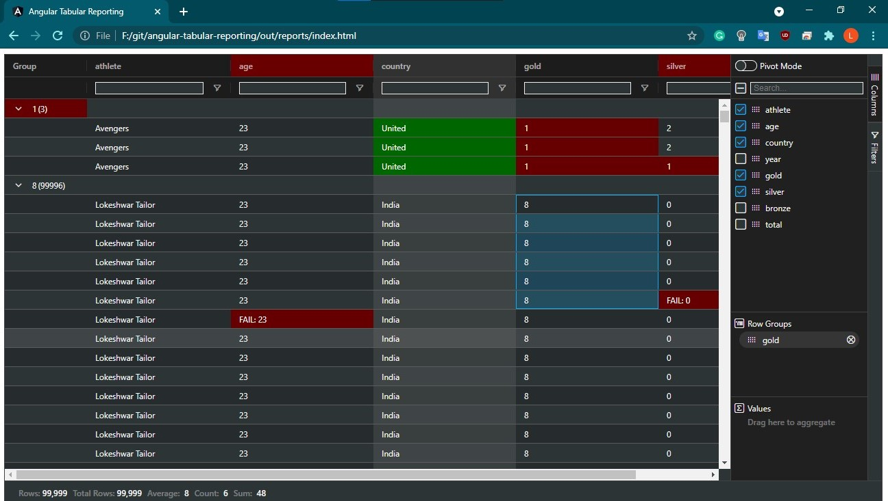

# `ANGULAR` `AG-GRID` : Tabular Reporting (CSV to HTML)

## library : <https://www.ag-grid.com/>

---

## Approach

* A static standalone angular project
* Java for
  * Injecting `csv` data in `main*.js` file
  * Injecting `css` to highlight `FAILED:` columns in `style*.css`

### Out-of-box mostly used features of ag-grid

* Supports `huge number of rows` for viewing 
* tested upto 100K rows without screen lag
* `Pivot Creation` 
* `Charts` e.g. Column, Bar, Pie, Histogram, etc.
* `Group By`, `Sorting`, `Filtering` of columns
* `Export` as csv or .xml

---

#### Execution

> `gson-2.8.7.jar` should be present @ `java-jars/` path

```sh
javac -cp ".;java-jars/*" DataService.java
java -cp ".;java-jars/*" DataService
```

---

### Outputs

* `data.csv` is parsed for viewing
* `out/reports/index.html` = final reports
* `columns_to_hide_on_1st_load.txt` contains columns t hide on first load

---

#### Set Up [ for `localhost`]

```sh
1. install node.js @ https://nodejs.org/en/download/

2. npm install -g @angular/cli

3. npm install 
# in certain circumstances npm will perform an "auto prune". 
# This step ensures all expected dependencies are | present

4. ng new app

5. cd app

6. npm install --save ag-grid-community ag-grid-angular ag-grid-enterprise

# perform ag-grid changes form documentation

7. ng serve
```

---

> standalone app : `ng build --prod --base-href ./`

---

## angular clean install

```sh
ng --version

npm uninstall -g @angular/cli

npm cache clean --force

npm install -g @angular/cli@~11.2.9
or
npm install -g @angular/cli

ng --version
```

---



---
